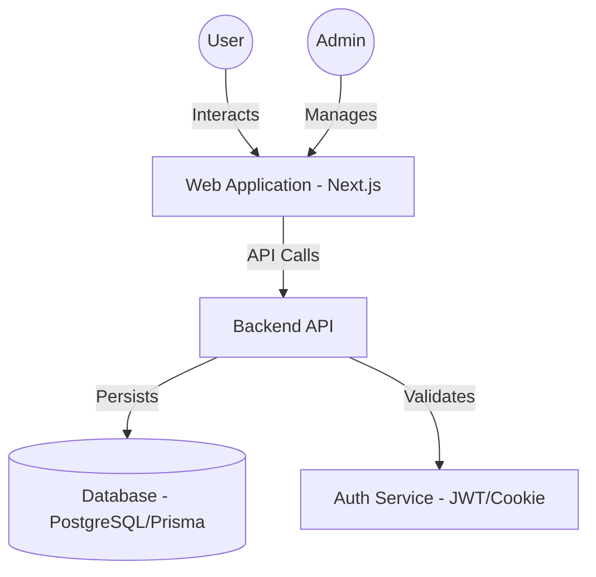
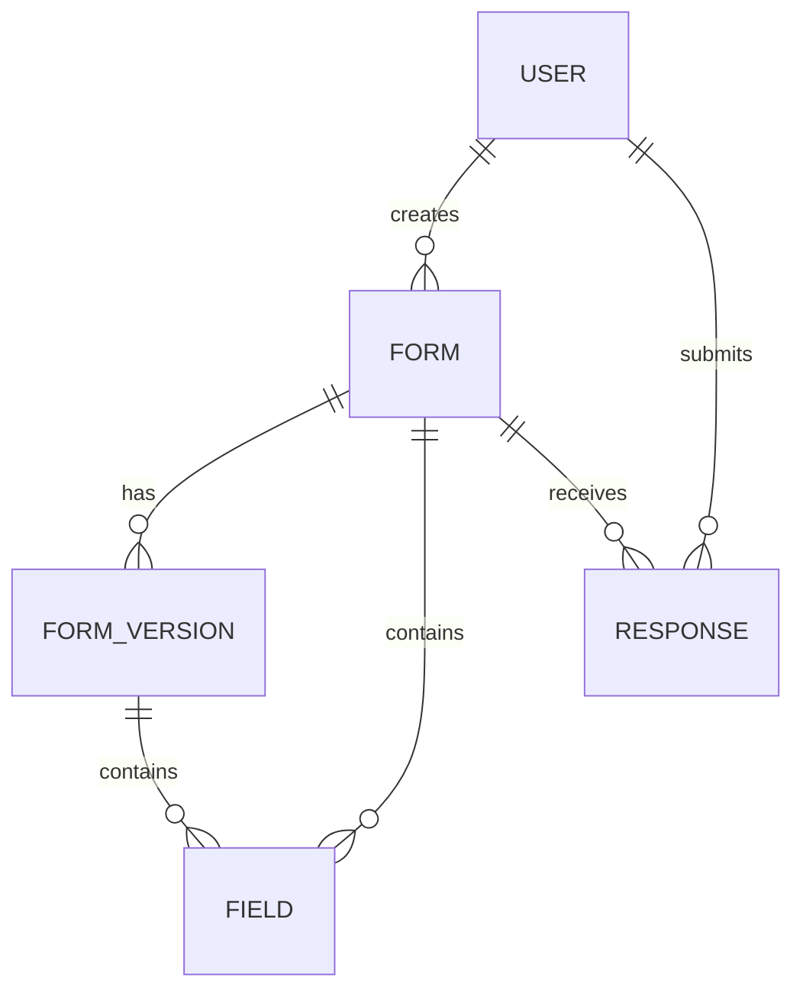

# Architecture Overview

## System Context Diagram



## Module Structure (Frontend)

```mermaid
graph LR
    subgraph "App Layer (Next.js App Router)"
        Routes[Routes / Pages]
        Layouts[Layouts]
        Middleware[Middleware]
    end

    subgraph "Component Layer"
        UI[Radical UI Components]
        FormBuilder[Form Builder Engine]
        Dashboard[Dashboard Widgets]
    end

    subgraph "Logic Layer"
        Hooks[Custom Hooks (useAuth, useForm)]
        Store[State Management (Zustand/Context)]
    end

    subgraph "Service Layer"
        APIClient[Axios/Fetch Client]
        Mappers[Data Transformers]
    end

    Routes --> UI
    Routes --> Hooks
    FormBuilder --> Hooks
    Hooks --> Store
    Hooks --> APIClient
```

## Data Entity Relationship (Simplified)


