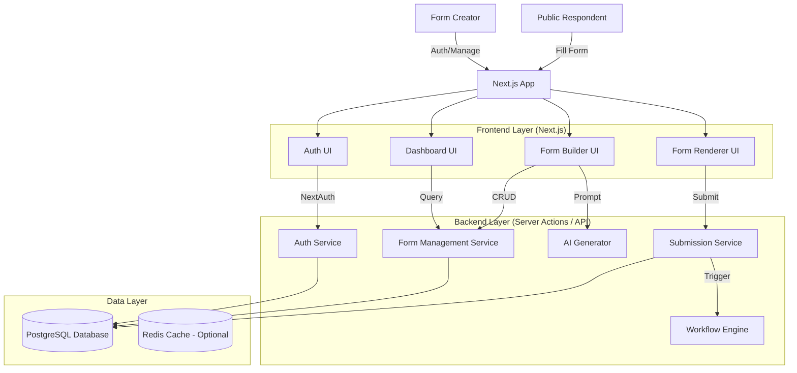

# Architecture Overview

This document outlines the high-level architecture of the Form Management Platform.

## System Context Diagram

## Module Definitions

### 1. Authentication Module

- **Responsibility**: Handles user registration, login, session management (JWT/Session), and Role-Based Access Control (RBAC).
- **Key Components**: `NextAuth.js`, `Middleware`, `RoleGuard`.

### 2. Form Builder Module

- **Responsibility**: Provides the WYSIWYG interface for creating forms. Manages form schemas, versioning, and validation rules.
- **Key Components**: `DragDropContext`, `FieldRegistry`, `FormSchemaGenerator`.

### 3. Respondent Interface (Renderer)

- **Responsibility**: Renders the form based on the schema, executes client-side validation (Zod), and handles conditional logic visibility.
- **Key Components**: `FormRenderer`, `LogicEvaluator`, `SubmissionHandler`.

### 4. Workflow Engine

- **Responsibility**: Processes post-submission actions asynchronously. Handles approvals, email notifications, and webhook dispatch.
- **Key Components**: `ApprovalQueue`, `NotificationService`, `WebhookDispatcher`.

### 5. AI Service

- **Responsibility**: Converts natural language prompts into valid Form Schemas.
- **Key Components**: `PromptEngine`, `SchemaMapper`.

## Data Flow (Submission)

1. **Respondent** submits data via `RendererUI`.
2. `SubAPI` validates data against Zod Schema.
3. Data is persisted to `DB`.
4. `WorkflowAPI` is triggered.
5. If **Approval** required -> Status set to `PENDING_APPROVAL`.
6. Else -> Notifications sent, Webhooks fired.
