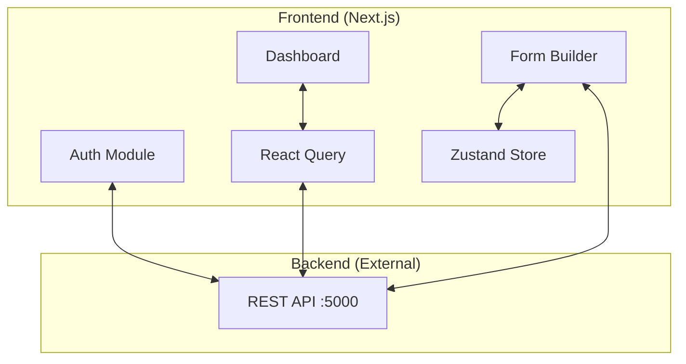
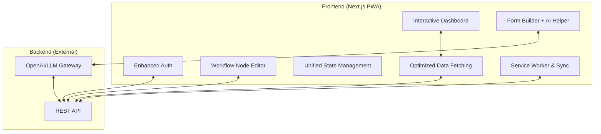

# Architecture Diagrams

## As-Is Architecture (Current)

The current system is a basic Next.js frontend with authentication and a form builder.

## To-Be Architecture (Target)

The target includes AI assistance, workflow automation, and full PWA support.

## Data Flow: Form Submission (Target)

1. User fills form.
2. Zod validates locally.
3. If offline, Service Worker queues submission.
4. If online, Axios sends to API.
5. Notification sent via Workflow engine.
