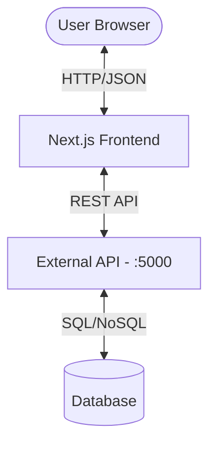

# System Map

## High-Level Architecture

The application is a Next.js Frontend that communicates with a REST API.

## Module Responsibilities

### Frontend (`src/`)

- `app/`: Next.js App Router pages and layouts.
- `components/`: Reusable UI components (Shadcn UI based).
- `hooks/`: Custom React hooks for data fetching and logic.
- `lib/`: Utility functions and API client (Axios).
- `store/`: Client-side state management (Zustand).
- `types/`: TypeScript interfaces and types.

### Key Routes

- `/`: Landing/Home
- `/login`, `/register`: Authentication
- `/dashboard`: User workspace
- `/builder/new`: Form creation interface
