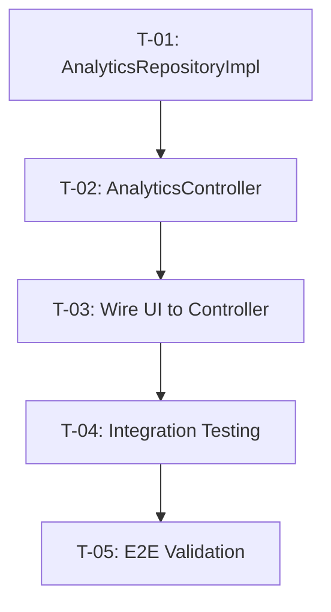

# Analytics Integration - Prompt Routing Decisions

## Task Overview

**Task**: M-11 Analytics Integration  
**Priority**: HIGH  
**Project Phase**: Phase 5 - Polish & Launch  
**Status**: Backend ready, UI built, integration pending

## Routing Strategy

Based on the analysis of `agent/AGENT_MANIFEST.md`, `agent/00_system/10_orchestration_protocol.md`, and `agent/00_system/11_prompt_router.md`, the Analytics Integration task is decomposed into subtasks with the following routing decisions:

### Subtask Routing Matrix

| Subtask ID | Subtask Description | Task Type | Domain | Profile Target | Context Stack |
| --- | --- | --- | --- | --- | :--- |
| T-01 | Create AnalyticsRepositoryImpl | Implementation | Data Layer | `profile_implementer.md` | `agent/06_skills/implementation/`, `agent/06_skills/analysis/skill_dependency_mapping.md` |
| T-02 | Create AnalyticsController | Implementation | State Management | `profile_implementer.md` | `agent/06_skills/implementation/`, `agent/04_workflows/06_feature_implementation_loop.md` |
| T-03 | Wire UI to Controller | Implementation | UI Integration | `profile_implementer.md` | `agent/06_skills/implementation/skill_impl_flutter_widget.md` |
| T-04 | Integration Testing | Testing | Validation | `profile_tester.md` | `agent/06_skills/analysis/skill_codebase_survey.md` |
| T-05 | End-to-End Validation | Review | Quality | `profile_pr_reviewer.md` | `agent/05_gates/by_stack/flutter/gate_flutter_tests.md` |

## Profile Justifications

### profile_implementer.md (Primary)

- **Rationale**: Repository creation and controller wiring are implementation tasks requiring Flutter/Riverpod expertise
- **Selection Criteria**: Matches "Feature Implementation" task type from `agent/00_system/11_prompt_router.md`
- **Context Stack**: Skills for implementation patterns and feature slicing

### profile_tester.md (Secondary)

- **Rationale**: Integration testing requires test-first approach and validation patterns
- **Selection Criteria**: Matches "Testing" requirements from the workflow
- **Context Stack**: Testing skills and validation patterns

### profile_pr_reviewer.md (Final Gate)

- **Rationale**: Final validation requires quality gate review before merge
- **Selection Criteria**: Matches "PR Review" task type
- **Context Stack**: Gate checklists and quality standards

## Execution Sequence

## Context Stack Summary

For each subtask, the Router must enforce modular context loading:

1. **T-01**: Stack rules for Flutter, Repository pattern docs
2. **T-02**: Riverpod state management patterns
3. **T-03**: Flutter widget implementation skills
4. **T-04**: Integration testing patterns
5. **T-05**: Quality gate checklists

## Related Artifacts

- Project State: `agent/09_state/PROJECT_STATE.md`
- Integration Progress: `plans/INTEGRATION_PROGRESS.md`
- Orchestration Protocol: `agent/00_system/10_orchestration_protocol.md`
- Prompt Router: `agent/00_system/11_prompt_router.md`
